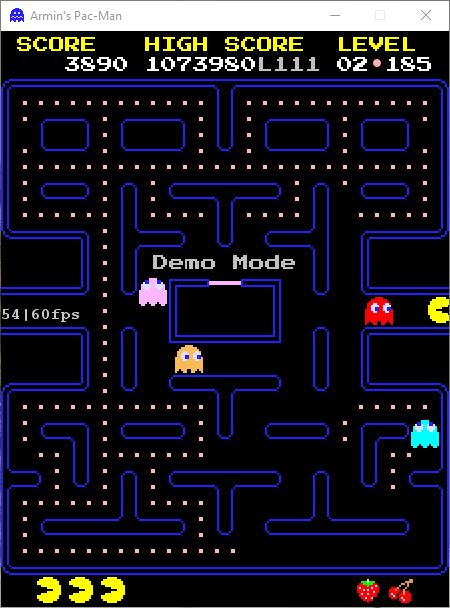

# easy-game

A Java2D/Swing based library for programming Java 2D games and other applications using active rendering. Makes it easy to create and launch a game application, provides integrated window-mode/full-screen switching, polling for keyboard and mouse events, standard hooks for initializing, updating and rendering, game entities with an associated transform object, support for sprites with different animation types, asset management (images, fonts, sounds), some common widgets etc. The animation frequency ("frame rate") can be changed interactively using a dialog window. This allows to run each application at an arbitray frame rate and to inspect it at runtime in slow motion.

## Minimal application

A minimal application is created by the following code:

```java
public class MyFirstApp extends Application {

	public static void main(String... args) {
		launch(MyFirstApp.class, args);
	}

	@Override
	public void configure(AppSettings settings) {
		settings.width = 800;
		settings.height = 600;
		settings.title = "My First Application";
	}

	@Override
	public void init() {
		setController(new MyFirstAppController());
}
 
class MyFirstAppController implements Lifecycle {
 
	@Override
	public void init() {
	}

	@Override
	// gets called at every tick of the application clock, normally 60 times/sec
	public void update() {
	}
}
```

## Application lifecycle finite-state machine

```java
StateMachine.beginStateMachine(ApplicationState.class, ApplicationEvent.class, EventMatchStrategy.BY_EQUALITY)
	.description(String.format("[%s]", getClass().getName()))
	.initialState(STARTING)
	.states()

		.state(STARTING)
			.onEntry(() -> {
				// let application initialize itself and select a main controller:
				init();
				if (controller == null) {
					// use fallback controller
					int width = 640, height = 480;
					setController(new AppInfoView(this, width, height));
					shell = new AppShell(this, width, height);
				} else {
					shell = new AppShell(this, settings.width, settings.height);
				}
				loginfo("Starting application '%s'", getClass().getName());
				SwingUtilities.invokeLater(this::showUIAndStartClock);
			})

		.state(RUNNING)
			.onTick(() -> {
				Keyboard.handler.poll();
				Mouse.handler.poll();
				collisionHandler().ifPresent(CollisionHandler::update);
				controller.update();
				currentView().ifPresent(shell::render);
			})

		.state(PAUSED)
			.onTick(() -> currentView().ifPresent(shell::render))

		.state(CLOSED)
			.onTick(() -> {
				shell.dispose();
				loginfo("Exit application '%s'", getClass().getName());
				System.exit(0);
			})

	.transitions()

		.when(STARTING).then(RUNNING).condition(() -> clock.isTicking())

		.when(RUNNING).then(PAUSED).on(TOGGLE_PAUSE).act(SoundSupport::muteAll)

		.when(RUNNING).then(CLOSED).on(CLOSE)

		.stay(RUNNING).on(TOGGLE_FULLSCREEN).act(() -> shell.toggleDisplayMode())

		.stay(RUNNING).on(SHOW_SETTINGS_DIALOG).act(() -> shell.showSettingsDialog())

		.when(PAUSED).then(RUNNING).on(TOGGLE_PAUSE).act(SoundSupport::unmuteAll)

		.when(PAUSED).then(CLOSED).on(CLOSE)

		.stay(PAUSED).on(TOGGLE_FULLSCREEN).act(() -> shell.toggleDisplayMode())

		.stay(PAUSED).on(SHOW_SETTINGS_DIALOG).act(() -> shell.showSettingsDialog())

.endStateMachine();
```

## Examples

- [Pong](https://github.com/armin-reichert/pong)


- [Flappy Bird](https://github.com/armin-reichert/birdy)

- [PacMan](https://github.com/armin-reichert/pacman)



- [Nine-mens morris](https://github.com/armin-reichert/nine-mens-morris)

- [Game of life](https://github.com/armin-reichert/school/GameOfLife)

