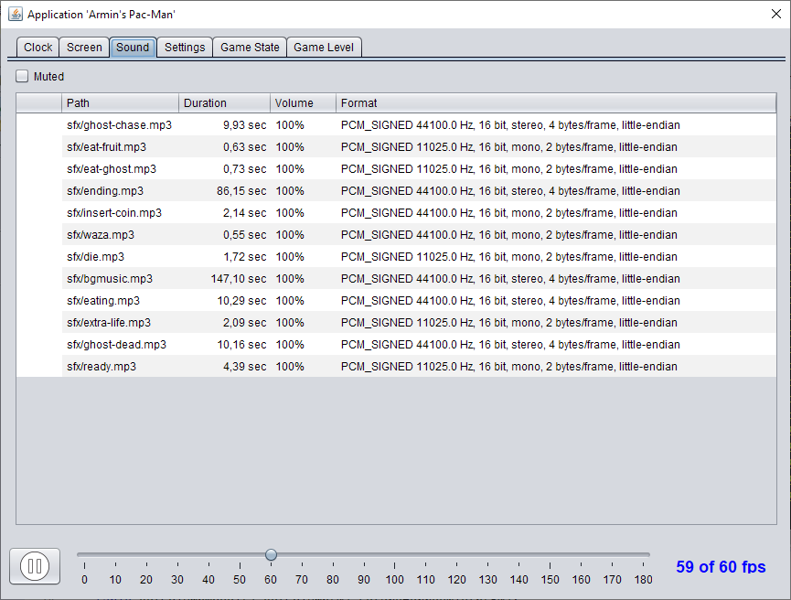
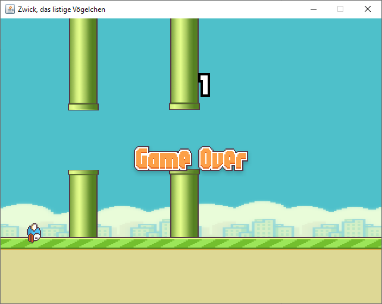
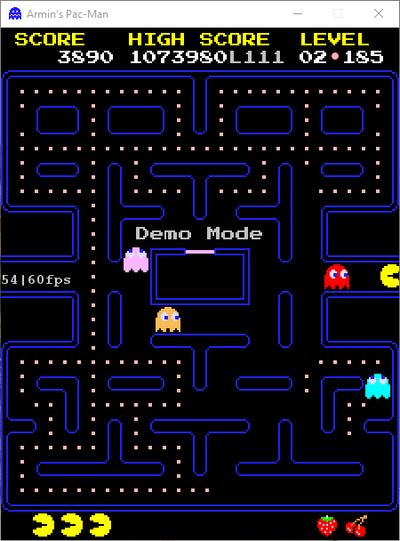
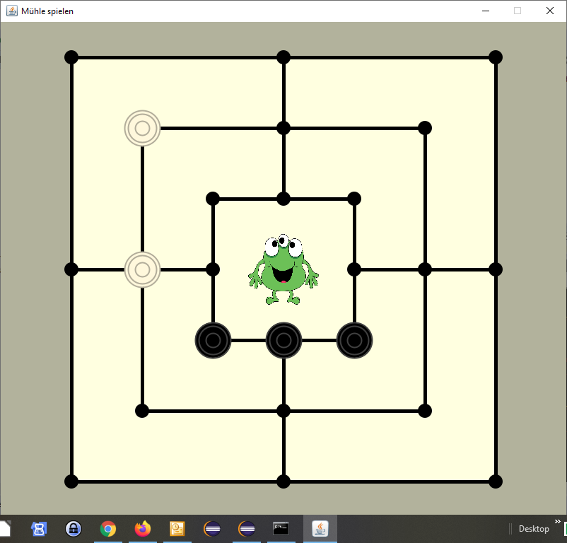
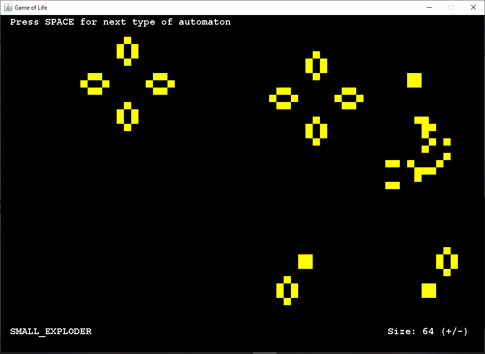

# easy-game

A simple Java2D/Swing based library for programming Java 2D games and other applications using active rendering. Makes it easy to create and launch a game application, provides integrated window-mode/full-screen switching, polling for keyboard and mouse events, standard hooks for initializing, updating and rendering, game entities with an associated transform object, support for sprites with different animation types, asset management (images, fonts, sounds), some common widgets etc. The animation frequency ("frame rate") can be changed interactively using a dialog window. This allows to run each application at an arbitray frame rate and to inspect it at runtime in slow motion.

## Common functionality

- CTRL+P pauses/resumes the game
- F2 opens a dialog where the game clock frequency and (full-)screen resolution can be changed
- F11 toggles between window and full-screen exclusive mode
 
## Command-line arguments:

The following command-line arguments are available for every application:

  - Framerate (default=60): `-fps 30`
  - Scaling (default=1): `-scale 2.5`
  - Full-screen mode on start (default=off): `-fullScreenOnStart`
  - Full-screen resolution & depth (default=maximal available resolution): `-fullScreenMode 800,600,32`
  - Window title (default="My Application!"): `-title "Pac-Man Game"`
  - Window title is additionally showing framerate and resolution (default=off): `-titleExtended`
  - Window width (default=640): `-width 1024`
  - Window height (default=480): `-height 768`
  - Rendering with image smoothing (default=off); `-smoothRendering`

## A minimal application

A minimal application is created by the following code:

```java
public class MyFirstApp extends Application {

	public static void main(String... args) {
		launch(MyFirstApp.class, args);
	}

	@Override
	public void init() {
		setController(new MyFirstAppController());
	}
}
 
class MyFirstAppController implements Lifecycle {
 
	@Override
	public void init() {
		// do whatever
	}

	@Override
	public void update() {
		// called at every tick of the application clock, be default 60 times/sec
	}
}
```

## Application lifecycle

The lifecycle of any application is defined by the following finite-state machine:

```java
beginStateMachine(ApplicationState.class, ApplicationEvent.class, EventMatchStrategy.BY_EQUALITY)
	.description(String.format("[%s]", app.getName()))
	.initialState(STARTING)
	.states()

		.state(STARTING)
			.onEntry(() -> {
				app.init();
				SwingUtilities.invokeLater(app::showUIAndStart);
			})

		.state(RUNNING)
			.onTick(() -> {
				app.readInput();
				app.controller.update();
				app.render();
			})

		.state(PAUSED)
			.onTick(app::render)

		.state(CLOSING)
			.onEntry(() -> {
				loginfo("Closing application '%s'", app.getName());
				app.shell.dispose();
				System.exit(0);
			})

	.transitions()

		.when(STARTING).then(RUNNING).condition(() -> app.clock.isTicking())

		.when(RUNNING).then(PAUSED).on(TOGGLE_PAUSE).act(() -> app.soundManager.muteAll())

		.when(RUNNING).then(CLOSING).on(CLOSE)

		.stay(RUNNING).on(ApplicationEvent.TOGGLE_FULLSCREEN).act(() -> app.shell.toggleDisplayMode())

		.stay(RUNNING).on(SHOW_SETTINGS_DIALOG).act(() -> app.shell.showF2Dialog())

		.when(PAUSED).then(RUNNING).on(TOGGLE_PAUSE).act(() -> app.soundManager.unmuteAll())

		.when(PAUSED).then(CLOSING).on(CLOSE)

		.stay(PAUSED).on(TOGGLE_FULLSCREEN).act(() -> app.shell.toggleDisplayMode())

		.stay(PAUSED).on(SHOW_SETTINGS_DIALOG).act(() -> app.shell.showF2Dialog())

.endStateMachine();
```

## Integrated control dialog

By pressing the F2-key an integrated dialog is opened where you can interactively change the frequency of the game clock, watch the frame rate history and change the resolution of the full-screen mode. Applications can add custom tabs to this dialog, see for an example my Pac-Man game implementation.




## Examples

- [Pong](https://github.com/armin-reichert/pong)


- [Flappy Bird](https://github.com/armin-reichert/birdy)



- [PacMan](https://github.com/armin-reichert/pacman)



- [Nine-mens morris](https://github.com/armin-reichert/nine-mens-morris)



- [Game of life](https://github.com/armin-reichert/game-of-life)


